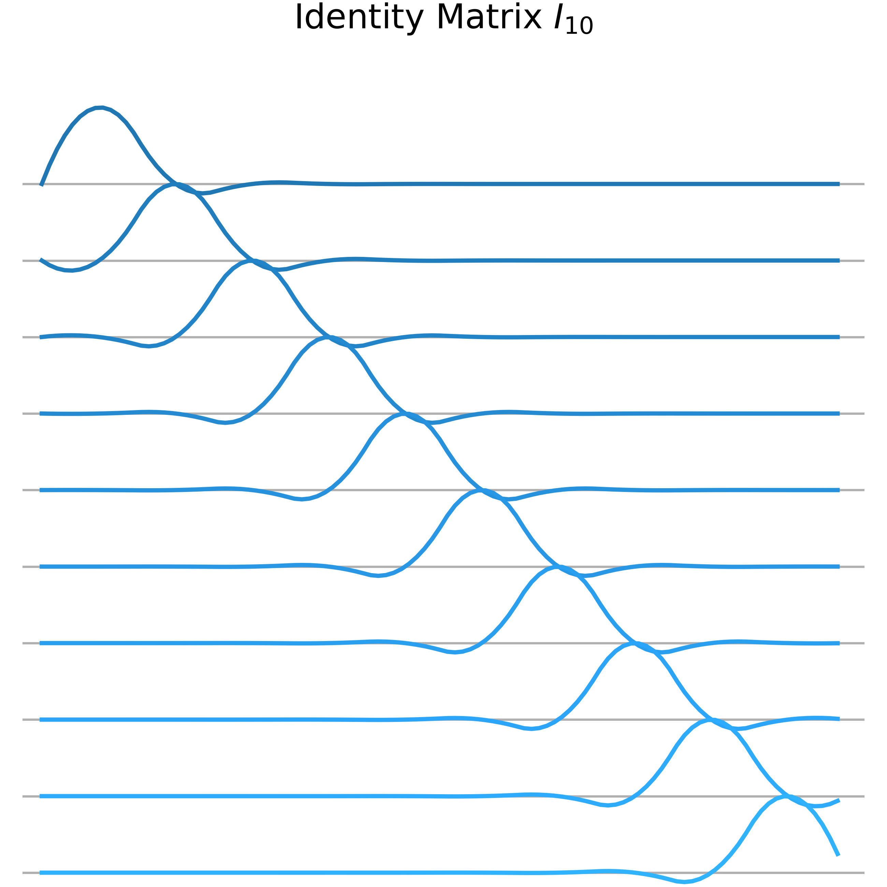
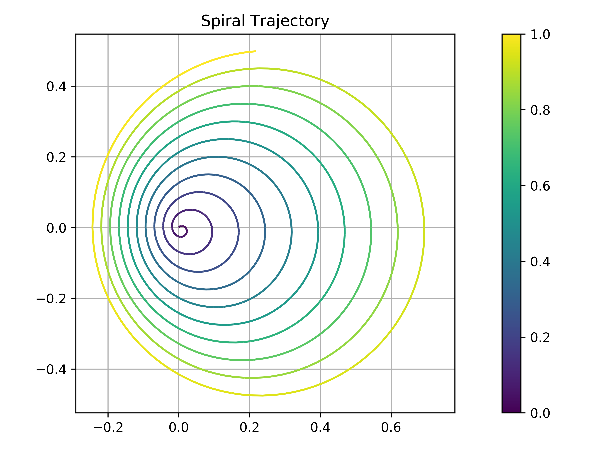
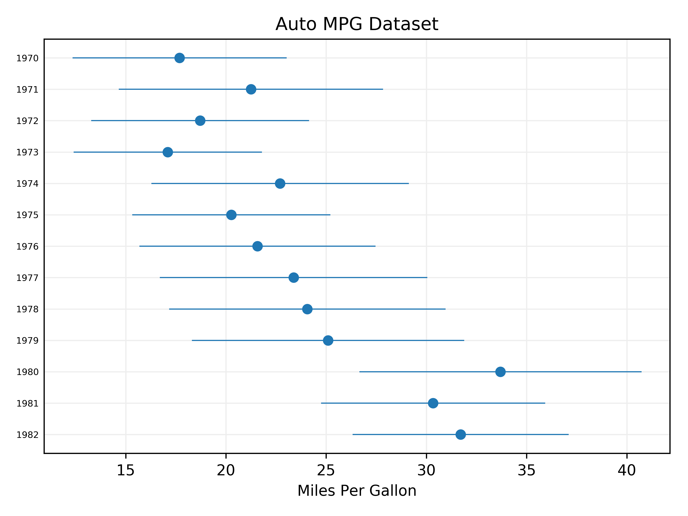
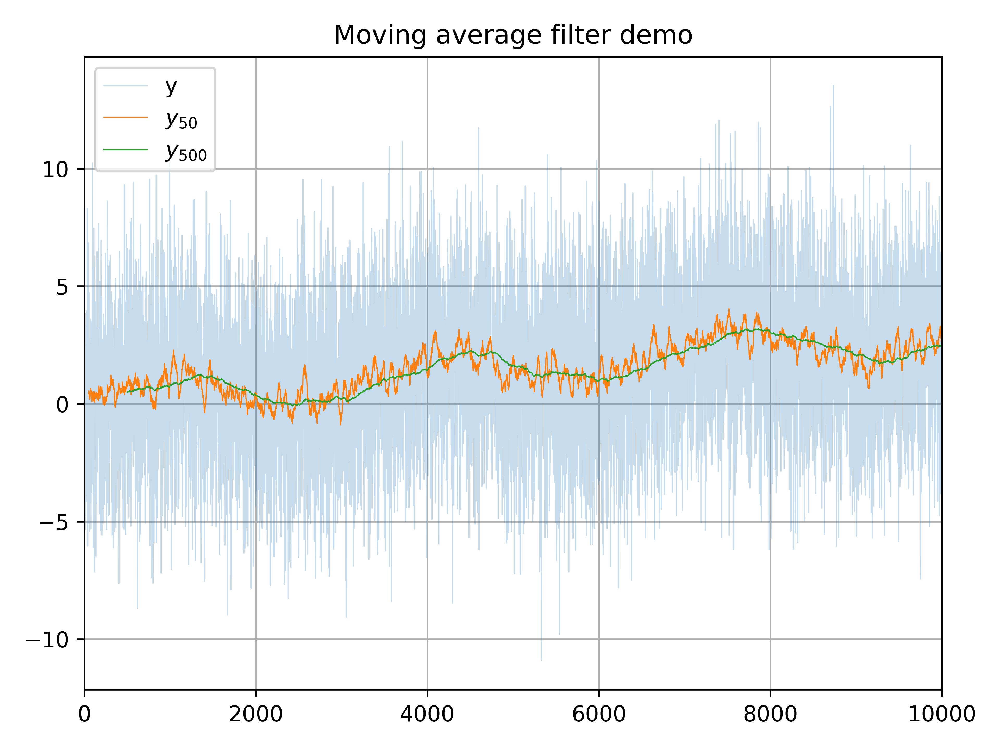

# mpl-utils

A collection of plotting functions for matplotlib

## Installation

This package is not distributed on PyPI - you'll need to install it from source:

```bash
$> git clone github.com/aaronsnoswell/mpl-utils
$> cd mpl-utils
$> pip install -e .
```

To test the installation:

```bash
$> cd ~
$> python
>>> import mpl_utils
>>> for d in mpl_utils.demos.values(): d()
```

## Provided functions

### [`thead_plot.py`](mpl_utils/thread_plot.py): Thread Plot

A plot designed for visualising large matrices or vectors.
Each row of the matrix is rendered as a spline-interpolated line, allowing 
structure in the matrix to be quickly visualised:

<p align="center" >
    
</p>

### [`xyt_plot.py`](mpl_utils/xyt_plot.py): XY-Time plot

Plots an X-Y trajectory, using color to show change over time.

<p align="center" >
    
</p>

### [`cleveland_dotplot.py`](mpl_utils/cleveland_dotplot.py): Cleveland Dot Plot

Plots observations across a categorical variable, along with some range for 
each observation.

<p align="center" >
    
</p>

### [`moving_average_plot.py`](mpl_utils/moving_average_plot.py): Moving Average Plot

Plot a moving-average filtered version of a signal.

<p align="center" >
    
</p>
